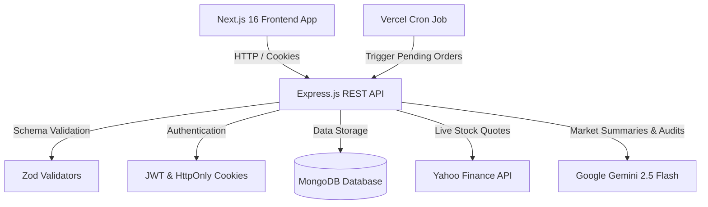

# TradeSim AI 📈🤖

> **Full-Stack Virtual Paper Trading Platform for Indian Equities powered by Google Gemini 2.5 Flash AI**

[](https://nextjs.org/)
[](https://react.dev/)
[](https://expressjs.com/)
[](https://www.typescriptlang.org/)
[](https://www.mongodb.com/)
[](https://deepmind.google/technologies/gemini/)
[](LICENSE)

---

TradeSim AI is an advanced, production-ready virtual paper trading simulator tailored for Indian Equities (NSE/BSE). Built with a modern full-stack architecture (**Next.js 16**, **Express.js**, **MongoDB**, **TypeScript**), it empowers beginners and seasoned traders alike to practice trading strategies with virtual capital of **₹10,00,000**, analyze live & historical market trends, manage watchlists, track portfolio analytics, and receive real-time educational insights driven by **Google Gemini AI**.

---

## 📑 Table of Contents

- [🌟 Key Features](#-key-features)
- [🛠️ Tech Stack](#️-tech-stack)
- [🏗️ System Architecture](#️-system-architecture)
- [📂 Directory Structure](#-directory-structure)
- [🚀 Getting Started](#-getting-started)
  - [Prerequisites](#prerequisites)
  - [1. Backend Setup](#1-backend-setup)
  - [2. Frontend Setup](#2-frontend-setup)
  - [3. Environment Variables Configuration](#3-environment-variables-configuration)
- [📡 API Documentation](#-api-documentation)
- [🧪 Running Automated Tests](#-running-automated-tests)
- [🛡️ Security Features](#️-security-features)
- [📄 License](#-license)

---

## 🌟 Key Features

### 📈 Real-Time Equities & Market Insights
* **Live Indian Equities Data**: Search and monitor real-time stock prices for NSE and BSE tickers (`.NS` and `.BO`).
* **Interactive Price Trends**: Responsive historical price charts (`1W`, `1M`, `1Y`) powered by `Recharts` and `Framer Motion`.
* **Custom Watchlists**: Pin favorite tickers for quick monitoring and seamless access.

### ⚡ Atomic Trading Engine
* **Virtual Capital Allocation**: Every new user starts with **₹10,00,000** in virtual capital to practice risk-free trading.
* **Multiple Order Types**: Supports **Market Orders**, **Limit Orders**, and **Stop-Loss Orders**.
* **Pending Order Processor**: Background engine and Vercel Cron routes automatically monitor and execute pending limit & stop-loss orders when market triggers are met.
* **Holdings & Ledger Accounting**: Real-time position tracking calculating weighted average buy price, current market value, and live P&L percentage splits.

### 🤖 Gemini AI Educational Assistant
* **AI Stock Analysis**: Real-time 2-sentence technical & price behavior reviews generated by **Google Gemini 2.5 Flash**.
* **AI Portfolio Diversification Audit**: Automated portfolio reviews analyzing asset concentration across market sectors with tailored risk management recommendations.
* **Smart Fallback Engine**: Built-in simulated AI analysis mode so the application runs seamlessly even if no API key is provided.

---

## 🛠️ Tech Stack

### Frontend
| Component | Technology | Description |
|---|---|---|
| **Framework** | Next.js 16 (App Router) | React server components, optimized client routing |
| **Language** | TypeScript 5 | Strict typing and auto-completion |
| **Styling** | Tailwind CSS v4 + Framer Motion | Dynamic dark-mode UI with fluid micro-animations |
| **Data Viz** | Recharts | Responsive SVG charts for market price trends |
| **Icons** | Lucide React | Modern vector icons |

### Backend
| Component | Technology | Description |
|---|---|---|
| **Runtime & Server** | Node.js + Express.js | High-performance RESTful API endpoints |
| **Language** | TypeScript 5 | End-to-end type safety |
| **Database** | MongoDB + Mongoose 8 | Document database for users, holdings, orders & transactions |
| **Validation** | Zod | Strict schema validation for incoming API requests |
| **Market Data** | Yahoo Finance API (`yahoo-finance2`) | Free live market quotes and historical OHLC data |
| **AI Integration** | Google GenAI SDK (`@google/genai`) | AI market summaries & portfolio diversification audits |
| **Testing** | Jest + Supertest | Integration route security tests and financial calculation unit tests |

---

## 🏗️ System Architecture



---

## 📂 Directory Structure

```
TradeSim AI/
├── backend/
│   ├── src/
│   │   ├── config/          # Database & environment configurations
│   │   ├── controllers/     # API request handlers (Auth, Stocks, Orders, Portfolio, Watchlist)
│   │   ├── middleware/      # Authentication & security rate limiters
│   │   ├── models/          # Mongoose schemas (User, Holding, Transaction, PendingOrder, Watchlist)
│   │   ├── routes/          # RESTful endpoint routes definition
│   │   ├── services/        # Business logic (Trading Engine, Market Data, Gemini AI, Portfolio Services)
│   │   ├── tests/           # Jest unit & integration test suites
│   │   ├── app.ts           # Express application configuration
│   │   └── server.ts        # Server entry point
│   ├── jest.config.js       # Jest configuration
│   ├── tsconfig.json        # Backend TypeScript config
│   └── package.json
│
├── frontend/
│   ├── src/
│   │   ├── app/             # Next.js App Router pages (Dashboard, Login, Register, Stocks, Portfolio)
│   │   ├── components/      # Reusable UI components (StockSearch dropdown, Charts, Modals)
│   │   ├── context/         # AuthContext provider
│   │   └── middleware.ts    # Next.js route protection middleware
│   ├── tsconfig.json        # Frontend TypeScript config
│   └── package.json
│
├── README.md                # Project documentation
└── package.json             # Root workspace script definitions
```

---

## 🚀 Getting Started

### Prerequisites

Make sure you have the following installed on your local machine:
- **Node.js**: `v18.x` or higher
- **npm**: `v9.x` or higher
- **MongoDB**: Community edition running locally on `mongodb://localhost:27017` (or a MongoDB Atlas connection URI).

---

### 1. Backend Setup

1. Open a terminal and navigate to the `backend` directory:
   ```bash
   cd backend
   ```
2. Install dependencies:
   ```bash
   npm install
   ```
3. Create a `.env` file in the `backend` root directory:
   ```env
   PORT=5000
   NODE_ENV=development
   MONGODB_URI=mongodb://localhost:27017/tradesim
   JWT_SECRET=super_secret_session_passphrase_32_chars
   GEMINI_API_KEY=YOUR_GEMINI_API_KEY_HERE
   FRONTEND_URL=http://localhost:3000
   ```
   *(Note: If `GEMINI_API_KEY` is omitted, TradeSim AI will automatically supply simulated educational fallback responses without failing requests).*

4. Start the backend development server:
   ```bash
   npm run dev
   ```

---

### 2. Frontend Setup

1. Open a second terminal window and navigate to the `frontend` directory:
   ```bash
   cd frontend
   ```
2. Install dependencies:
   ```bash
   npm install
   ```
3. Create a `.env.local` file in the `frontend` root directory:
   ```env
   NEXT_PUBLIC_API_URL=http://localhost:5000/api/v1
   ```
4. Start the Next.js development server:
   ```bash
   npm run dev
   ```
5. Open your browser and navigate to **`http://localhost:3000`**.

---

## 📡 API Documentation

### Authentication Routes (`/api/v1/auth`)
| Method | Endpoint | Description | Auth Required |
|---|---|---|:---:|
| `POST` | `/register` | Create a new user account & initialize virtual capital (₹10L) | ❌ |
| `POST` | `/login` | Authenticate user & issue HttpOnly JWT cookie | ❌ |
| `POST` | `/logout` | Clear authentication session cookie | ❌ |
| `GET` | `/me` | Fetch active user profile and current balance | ✅ |

### Stock Market Routes (`/api/v1/stocks`)
| Method | Endpoint | Description | Auth Required |
|---|---|---|:---:|
| `GET` | `/search?q=:query` | Search Indian stocks (NSE/BSE) by symbol or name | ❌ |
| `GET` | `/:symbol` | Fetch live quote, session stats & AI market summary | ❌ |
| `GET` | `/:symbol/history?range=1M` | Fetch historical price points for charting (`1W`, `1M`, `1Y`) | ❌ |

### Trading & Orders (`/api/v1/orders`)
| Method | Endpoint | Description | Auth Required |
|---|---|---|:---:|
| `POST` | `/` | Execute Market order or queue Limit / Stop-Loss order | ✅ |
| `GET` | `/pending` | Retrieve active pending limit and stop-loss orders | ✅ |
| `DELETE`| `/pending/:id` | Cancel an unexecuted pending order | ✅ |

### Portfolio & Watchlist (`/api/v1/portfolio` & `/api/v1/watchlist`)
| Method | Endpoint | Description | Auth Required |
|---|---|---|:---:|
| `GET` | `/portfolio` | Fetch user holdings, P&L analytics & Gemini portfolio audit | ✅ |
| `GET` | `/watchlist` | Fetch pinned ticker symbols | ✅ |
| `POST` | `/watchlist` | Add a ticker symbol to user watchlist | ✅ |
| `DELETE`| `/watchlist/:symbol` | Remove a symbol from user watchlist | ✅ |

---

## 🧪 Running Automated Tests

TradeSim AI includes integration test suites powered by **Jest** and **Supertest** covering route authorization, user registration, database transaction isolation, and trading calculations.

Run the test suite from the `backend` directory:
```bash
cd backend
npm test
```

---

## 🛡️ Security Features

- **HttpOnly Cookie Sessions**: Authentication tokens are stored in secure, HttpOnly, SameSite cookies to mitigate XSS vulnerabilities.
- **Strict Request Validation**: Incoming payloads are parsed and sanitized using `Zod` schemas before hitting controllers.
- **IP Rate Limiting**: `express-rate-limit` prevents brute-force login attempts and endpoint abuse.
- **Security Headers**: `helmet` is enabled across all backend routes to set protective HTTP headers.

---

## 📄 License

Distributed under the MIT License. See `LICENSE` for more information.
